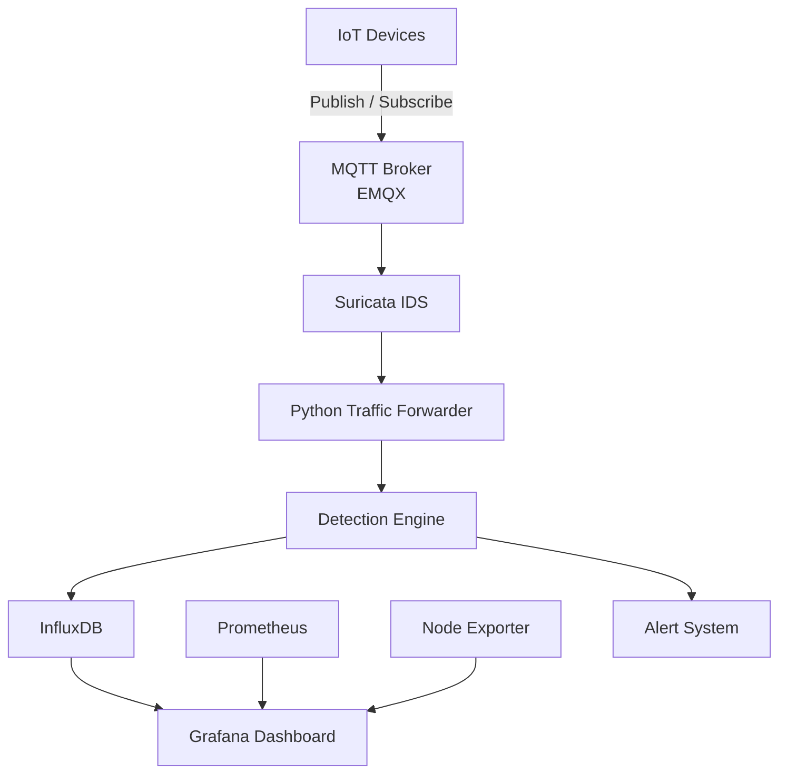
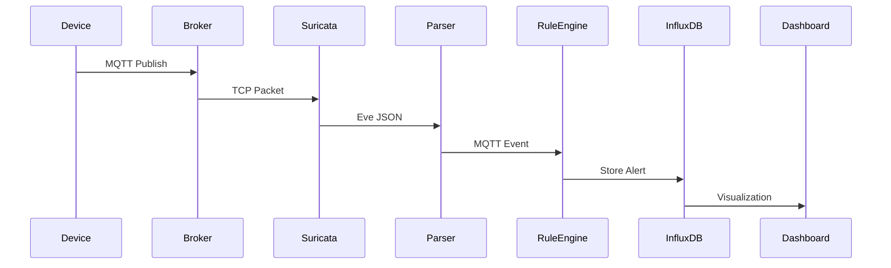
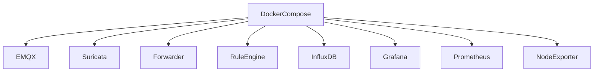
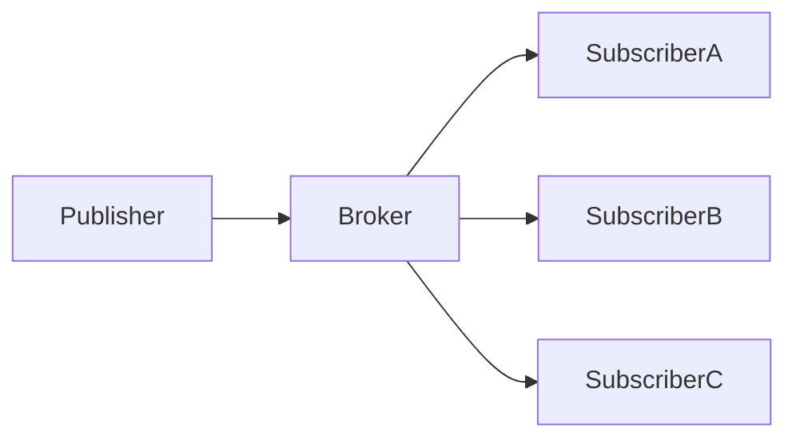
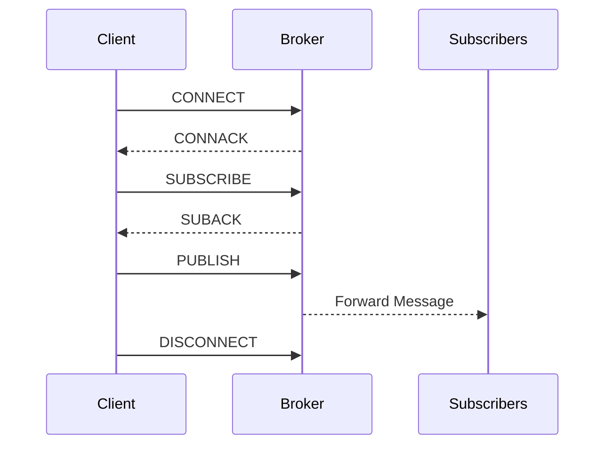
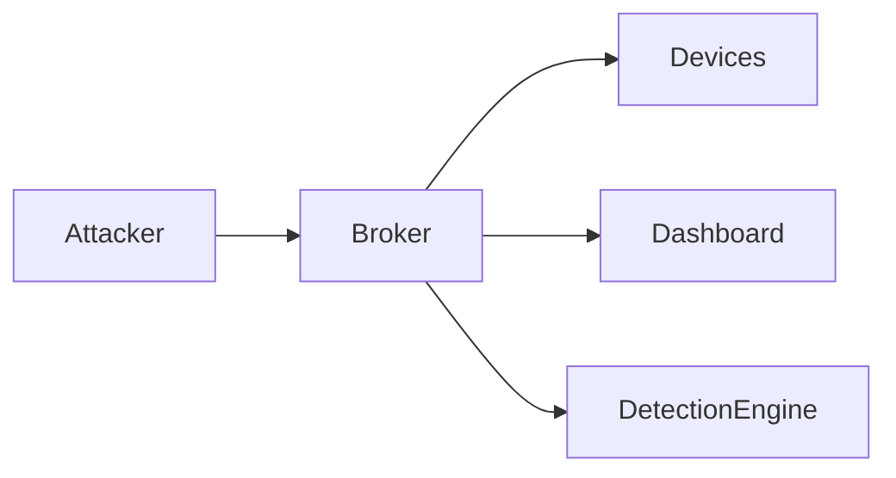
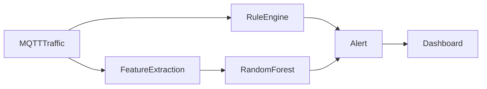
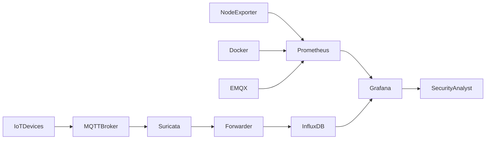

<!-- ========================================================= -->
<!--                       TraceMQ                             -->
<!-- ========================================================= -->

<p align="center">


</p>

<h1 align="center">
TraceMQ
</h1>

<p align="center">
<b>A Hybrid MQTT Intrusion Detection & Monitoring Platform for IoT Networks</b>
</p>

<p align="center">


</p>

---

<p align="center">

**A Lightweight, Explainable and Production-Oriented MQTT Intrusion Detection Platform Designed for Internet of Things (IoT) Networks**

</p>

---

# 📖 Table of Contents

- Overview
- Abstract
- Motivation
- Background
- Research Problem
- Research Gap
- Why TraceMQ?
- Design Philosophy
- Key Features
- Major Contributions
- Project Objectives
- High-Level Architecture
- Technology Stack

---

# 🌍 Overview

TraceMQ is an open-source, lightweight Intrusion Detection and Monitoring Platform specifically designed for MQTT-based Internet of Things (IoT) environments.

Unlike traditional Intrusion Detection Systems (IDS), which primarily inspect TCP/IP packets, TraceMQ introduces protocol-aware analysis by understanding MQTT communication semantics, client behaviors, topic activities, broker events, and security anomalies in real time.

The platform combines deterministic Rule-based Detection with Machine Learning-assisted analysis to achieve both high detection accuracy and practical deployability.

TraceMQ was developed as the Capstone Project (IAP491) at FPT University Da Nang and aims to bridge the gap between academic cybersecurity research and real-world industrial deployment.

The project integrates multiple open-source technologies including:

- EMQX MQTT Broker
- Suricata IDS
- Docker Compose
- Python Detection Engine
- InfluxDB
- Grafana
- Prometheus

to provide a complete security monitoring ecosystem for modern IoT infrastructures.

---

# 📄 Abstract

The rapid adoption of the Internet of Things (IoT) has fundamentally transformed industries such as manufacturing, healthcare, transportation, agriculture, logistics, and smart cities.

Despite these advancements, the increasing number of connected devices has significantly expanded the cyberattack surface.

Message Queuing Telemetry Transport (MQTT) has become one of the most widely adopted communication protocols due to its lightweight architecture and publish/subscribe messaging model.

However, MQTT deployments often suffer from security weaknesses including:

- Weak authentication
- Default configurations
- Missing TLS encryption
- Improper Access Control Lists (ACL)
- Anonymous client access
- Unlimited publish rate
- Topic wildcard abuse
- Client identity spoofing

Existing Intrusion Detection Systems often focus on generic network traffic while lacking protocol-level understanding of MQTT communications.

Furthermore, many recent research works rely exclusively on Machine Learning or Deep Learning approaches, introducing several practical challenges:

- High computational requirements
- Continuous model retraining
- Large labeled datasets
- Poor explainability
- Limited reproducibility
- Difficult deployment in SMEs

TraceMQ proposes a hybrid architecture combining lightweight Rule-based Detection with Machine Learning assistance to provide explainable, scalable, and production-oriented intrusion detection suitable for both academic research and industrial deployment.

---

# 🚀 Motivation

Most Small and Medium-sized Enterprises (SMEs) do not possess sufficient cybersecurity resources to deploy sophisticated Security Information and Event Management (SIEM) platforms or computationally intensive AI-based IDS solutions.

Several practical issues remain unresolved:

- MQTT brokers are frequently deployed with insecure default configurations.
- Industrial gateways typically have limited computing resources.
- Security administrators require explainable alerts rather than black-box predictions.
- Existing open-source solutions rarely understand MQTT semantics.

Therefore, TraceMQ was designed with the following philosophy:

> Simplicity over complexity.

> Explainability over black-box intelligence.

> Practical deployment over laboratory evaluation.

Instead of replacing rule-based detection, TraceMQ enhances it with lightweight Machine Learning modules capable of detecting stealthier attack behaviors while preserving system transparency.

---

# 🌐 Background

The Internet of Things ecosystem continues to expand rapidly.

Applications include:

- Smart Homes
- Smart Manufacturing
- Industrial Automation
- Healthcare Monitoring
- Smart Agriculture
- Intelligent Transportation
- Environmental Monitoring
- Smart Grid
- Smart Buildings
- Edge Computing

Most IoT devices rely on MQTT because it offers:

- Lightweight protocol design
- Low bandwidth consumption
- Reliable message delivery
- Publish/Subscribe communication
- Excellent scalability
- Cross-platform compatibility

Unfortunately, MQTT security has not evolved at the same pace as its widespread adoption.

Numerous production deployments remain vulnerable to common attacks.

---

# ❗ Research Problem

Although MQTT has become a de facto communication protocol for IoT systems, security monitoring remains a significant challenge.

Current deployments often lack:

- Continuous monitoring
- Real-time visualization
- Protocol-aware detection
- Security alert correlation
- Historical traffic analysis
- Lightweight deployment

Consequently, organizations frequently detect attacks only after service disruption or system compromise has occurred.

---

# 🔬 Research Gap

Recent MQTT intrusion detection studies primarily focus on supervised Machine Learning algorithms.

Common approaches include:

- Random Forest
- Support Vector Machine
- Decision Tree
- XGBoost
- Convolutional Neural Networks
- Long Short-Term Memory Networks
- AutoEncoders

While these approaches achieve impressive laboratory performance, several limitations remain.

## High Computational Cost

Many models require:

- GPU acceleration
- Continuous retraining
- Large memory
- Feature engineering
- Long inference time

These requirements make deployment difficult for SMEs.

---

## Poor Explainability

Machine Learning predictions rarely explain:

- Why an alert occurred.
- Which MQTT topic triggered detection.
- Which client behaved abnormally.
- Which protocol feature caused classification.

Security analysts therefore struggle to validate detection results.

---

## Dataset Dependency

Existing solutions often depend on:

- MQTT-IoT-IDS2020
- MQTTset
- CICIoT2023

These datasets may become outdated and do not represent evolving attack behaviors.

---

## Limited Attack Coverage

Many academic studies evaluate only:

- DoS
- Brute Force

while ignoring protocol-specific attacks including:

- Topic Enumeration
- Wildcard Abuse
- QoS Abuse
- Client ID Takeover
- Session Hijacking
- Retain Abuse
- Reconnect Storm
- SlowITe

---

# 💡 Why TraceMQ?

TraceMQ was designed to bridge the gap between academic IDS research and practical deployment.

Rather than replacing traditional Rule-based IDS, TraceMQ combines deterministic security rules with Machine Learning assistance.

This hybrid approach provides:

- High detection accuracy
- Excellent explainability
- Low computational overhead
- Fast response time
- Lightweight deployment
- Easy maintenance
- Real-world reproducibility

The objective is not to compete with enterprise SIEM platforms but to provide a lightweight security monitoring solution specifically optimized for MQTT environments.

---

# 🧠 Design Philosophy

TraceMQ follows several core design principles.

## Lightweight

Designed to operate efficiently on commodity hardware.

## Explainable

Every detection event includes explicit evidence describing why an alert was generated.

## Modular

Each service operates independently using Docker containers.

## Protocol-aware

Detection logic understands MQTT communication semantics.

## Production-oriented

Deployment requires minimal configuration.

## Reproducible

Entire platform can be recreated using Docker Compose.

---

# ⭐ Key Features

## MQTT-aware Monitoring

- Publish Monitoring
- Subscribe Monitoring
- Client Session Tracking
- Topic Analysis
- Broker Monitoring
- Traffic Visualization

---

## Intrusion Detection

Supports protocol-specific attack detection including:

- Publish Flooding
- Authentication Brute Force
- Rotating Username Attack
- Client ID Takeover
- Topic Enumeration
- Wildcard Abuse
- QoS Abuse
- SlowITe
- Reconnect Storm
- Unauthorized Publisher
- Unauthorized Subscriber

---

## Visualization

Real-time dashboards include:

- MQTT Throughput
- Connected Clients
- Publish Rate
- Subscribe Rate
- Alert Timeline
- Broker Status
- CPU Usage
- Memory Usage
- Attack Statistics
- Traffic Distribution

---

## Monitoring

Integrated monitoring stack:

- Grafana
- Prometheus
- InfluxDB
- Node Exporter
- Docker Metrics
- Suricata Logs

---

# 🏆 Major Contributions

Compared with previous MQTT IDS research, TraceMQ introduces several novel contributions.

✅ Hybrid Rule-based + Machine Learning architecture

✅ Explainable protocol-aware detection

✅ Multi-dataset normalization

✅ Lightweight Docker deployment

✅ Industrial IoT simulation (300 virtual devices)

✅ Five-zone Smart Factory model

✅ Real-time monitoring dashboard

✅ Containerized deployment

✅ Open-source implementation

✅ Complete documentation

---

# 🎯 Project Objectives

The project aims to achieve the following objectives.

## Functional Objectives

- Monitor MQTT traffic continuously.
- Detect protocol-aware attacks.
- Generate explainable alerts.
- Visualize security events.
- Store historical telemetry.

---

## Technical Objectives

- Lightweight deployment
- Modular architecture
- Docker containerization
- Easy scalability
- Real-time monitoring

---

## Research Objectives

- Compare Rule-based IDS with Machine Learning.
- Evaluate hybrid detection performance.
- Standardize MQTT security datasets.
- Improve practical reproducibility.

---

# 🛠 Technology Stack

| Category | Technologies |
|-----------|--------------|
| Programming | Python |
| MQTT Broker | EMQX |
| IDS | Suricata |
| Database | InfluxDB |
| Dashboard | Grafana |
| Monitoring | Prometheus |
| Containerization | Docker Compose |
| Operating System | Ubuntu Linux |
| Version Control | Git |
| Protocol | MQTT v5 |

---

# 📌 Next Section

The next chapter introduces the complete system architecture, deployment topology, Docker workflow, MQTT communication pipeline, and protocol-aware detection pipeline with professional Mermaid diagrams.


---

# 🏗 System Architecture

## Architecture Overview

TraceMQ adopts a modular and containerized architecture that separates each functional component into an independent service. This design improves scalability, simplifies maintenance, and enables reproducible deployments using Docker Compose.

The platform continuously monitors MQTT traffic flowing through the broker, extracts protocol-specific metadata, correlates network events, applies hybrid detection techniques, stores telemetry data, and visualizes the results through interactive dashboards.

Unlike traditional IDS platforms that only inspect raw TCP/IP packets, TraceMQ analyzes MQTT communication at the application layer, providing richer context for attack detection.


---

# High-Level Architecture



---

# Overall Workflow

The complete monitoring workflow consists of several stages.

```
IoT Devices

↓

MQTT Broker

↓

Network Capture

↓

Suricata Inspection

↓

JSON Event Parsing

↓

MQTT Flow Correlation

↓

Rule-based Detection

↓

Machine Learning Analysis

↓

InfluxDB

↓

Grafana Dashboard

↓

Security Alert
```

---

# System Components

The TraceMQ platform consists of multiple loosely coupled components.

| Component | Purpose |
|------------|----------|
| EMQX | MQTT Broker |
| Suricata | Deep Packet Inspection |
| Python Forwarder | Event Parsing |
| Rule Engine | Signature Detection |
| ML Engine | Behavioral Detection |
| InfluxDB | Time-series Storage |
| Grafana | Dashboard |
| Prometheus | Resource Monitoring |
| Docker Compose | Deployment |

---

# Architecture Layers

TraceMQ can be divided into six logical layers.

```
+------------------------------------------------+

Visualization Layer

Grafana Dashboard

+------------------------------------------------+

Detection Layer

Rule Engine

Machine Learning

+------------------------------------------------+

Data Processing Layer

Python Event Correlator

+------------------------------------------------+

Traffic Inspection Layer

Suricata IDS

+------------------------------------------------+

Communication Layer

EMQX MQTT Broker

+------------------------------------------------+

IoT Layer

Sensors

Actuators

Controllers

Edge Devices

+------------------------------------------------+
```

---

# Component Responsibilities

## IoT Devices

The lowest layer consists of MQTT-enabled IoT devices.

Examples include:

- Temperature Sensors
- Smart Cameras
- PLC Controllers
- Raspberry Pi
- ESP32
- Smart Meters
- Smart Lights
- Environmental Sensors

Each device periodically publishes telemetry data to MQTT topics.

Example:

```
factory/zone1/temperature

factory/zone3/motor

factory/zone5/humidity
```

---

## MQTT Broker (EMQX)

EMQX acts as the central communication hub.

Responsibilities:

- Client Authentication
- Topic Routing
- Session Management
- Message Delivery
- TLS Encryption
- ACL Enforcement
- Connection Persistence

Protocols:

- MQTT v3.1
- MQTT v3.1.1
- MQTT v5

Ports:

```
1883

8883 (TLS)

8083

8084

18083 (Dashboard)
```

---

## Suricata IDS

Suricata performs Deep Packet Inspection.

Responsibilities:

- TCP Inspection
- TLS Inspection
- MQTT Detection
- Flow Tracking
- Signature Matching
- Protocol Parsing
- Eve JSON Logging

Generated outputs:

```
eve.json

stats.log

fast.log
```

---

## Python Traffic Forwarder

This service converts Suricata events into structured MQTT security records.

Responsibilities:

- Read Eve JSON

- Parse MQTT Metadata

- Extract Topic Names

- Extract Client IDs

- Extract QoS

- Extract Payload Length

- Normalize Timestamps

- Correlate Sessions

- Generate Security Events

---

# Event Processing Pipeline


---

# Rule Engine

The Rule Engine is responsible for deterministic attack detection.

Unlike Machine Learning models, every alert is generated from transparent rules.

Advantages:

- Fast

- Explainable

- Lightweight

- Easy to Debug

- No Training Required

Current implementation supports:

- Publish Flood

- Brute Force

- Wildcard Abuse

- Topic Enumeration

- Reconnect Storm

- Client ID Takeover

- QoS Abuse

- Unauthorized Publish

- Unauthorized Subscribe

---

# Machine Learning Module

The Machine Learning module complements deterministic rules.

Current algorithm:

```
Random Forest
```

Future algorithms:

- XGBoost

- Isolation Forest

- AutoEncoder

- LSTM

- Graph Neural Networks

The ML module focuses on:

- SlowITe

- Stealth Attacks

- Unknown Patterns

- Behavioral Anomalies

---

# InfluxDB

InfluxDB stores all processed telemetry.

Examples:

```
mqtt_events

mqtt_alerts

system_metrics

broker_metrics

network_statistics
```

Advantages:

- High Write Performance

- Time-series Optimization

- Easy Aggregation

- Long-term Storage

---

# Grafana Dashboard

Grafana visualizes system status.

Main dashboards include:

## MQTT Dashboard

- Publish Rate

- Subscribe Rate

- Connected Clients

- MQTT Throughput

- Packet Rate

---

## Security Dashboard

- Alert Timeline

- Top Attack Types

- Suspicious Topics

- Brute Force Attempts

- Publish Flood Events

- Failed Authentication

---

## Infrastructure Dashboard

- CPU Usage

- RAM Usage

- Disk Usage

- Docker Containers

- Network Interface

- Broker Health

---

# Prometheus

Prometheus periodically collects infrastructure metrics.

Metrics include:

- CPU

- Memory

- Disk

- Docker

- Network

- System Load

Collection interval:

```
15 seconds
```

---

# Data Flow

The following diagram illustrates how data moves across the platform.



---

# Communication Pipeline

```
IoT Device

↓

MQTT Broker

↓

TCP Packet

↓

Suricata

↓

JSON Log

↓

Parser

↓

MQTT Decoder

↓

Session Correlation

↓

Rule Engine

↓

InfluxDB

↓

Grafana

↓

Security Analyst
```

---

# Design Principles

The architecture follows several engineering principles.

## Separation of Concerns

Every component performs one dedicated responsibility.

---

## Containerization

Each service runs inside its own Docker container.

Advantages:

- Portability

- Scalability

- Isolation

- Easy Deployment

---

## Loose Coupling

Services communicate through standard interfaces.

Failure of one component has minimal impact on others.

---

## Observability

Every component exposes metrics and logs for monitoring.

---

## Extensibility

Future modules can be integrated without redesigning the entire architecture.

Examples:

- SIEM Integration

- Kafka

- Elasticsearch

- OpenSearch

- Wazuh

- Falco

- OpenTelemetry

---

# Why This Architecture?

Compared with monolithic IDS implementations, TraceMQ provides:

✅ Lightweight deployment

✅ Easy scalability

✅ Protocol-aware detection

✅ Explainable alerts

✅ Reproducible experiments

✅ Production-ready containerization

✅ Low computational overhead

---

---

# 📁 Project Structure

TraceMQ follows a modular and maintainable directory structure. Each component is isolated into its own folder, making development, testing, and deployment significantly easier.

```text
TraceMQ/
│
├── docker/                     # Docker configuration files
│
├── emqx/
│   ├── certs/
│   ├── acl.conf
│   ├── emqx.conf
│   └── docker-entrypoint.sh
│
├── suricata/
│   ├── suricata.yaml
│   ├── rules/
│   └── logs/
│
├── detection_engine/
│   ├── rules/
│   ├── models/
│   ├── detectors/
│   ├── parser.py
│   ├── engine.py
│   └── utils.py
│
├── mqtt_forwarder/
│   ├── publisher/
│   ├── subscriber/
│   ├── replay/
│   └── traffic_generator.py
│
├── dashboard/
│   ├── grafana/
│   └── provisioning/
│
├── influxdb/
│
├── prometheus/
│
├── datasets/
│
├── scripts/
│
├── docs/
│
├── screenshots/
│
├── tests/
│
├── docker-compose.yml
├── requirements.txt
├── README.md
└── LICENSE
```

---

# 🐳 Containerized Deployment

TraceMQ is fully containerized using Docker Compose.

Each service runs independently while communicating through an isolated Docker network.



---

# Docker Services

| Service | Purpose |
|----------|----------|
| EMQX | MQTT Broker |
| Suricata | Network IDS |
| Detection Engine | Rule Processing |
| Forwarder | Event Correlation |
| InfluxDB | Database |
| Grafana | Dashboard |
| Prometheus | Monitoring |
| Node Exporter | Host Metrics |

---

# Deployment Workflow

```
Git Clone

↓

Docker Compose

↓

Container Initialization

↓

Broker Startup

↓

IDS Startup

↓

Database Startup

↓

Dashboard Startup

↓

Traffic Replay

↓

Attack Detection

↓

Visualization
```

---

# ⚙ System Requirements

Minimum Requirements

| Component | Requirement |
|-----------|-------------|
| CPU | Dual Core |
| RAM | 4 GB |
| Disk | 20 GB |
| Docker | 24+ |
| Docker Compose | v2 |
| OS | Ubuntu 22.04 |

---

Recommended Requirements

| Component | Requirement |
|-----------|-------------|
| CPU | Quad Core |
| RAM | 8 GB |
| Disk | SSD |
| Docker | Latest |
| Linux Kernel | 5.15+ |

---

# 💻 Supported Operating Systems

Officially Tested

- Ubuntu 22.04 LTS
- Ubuntu Server
- Debian 12

Experimental

- Fedora
- Arch Linux
- Kali Linux
- Raspberry Pi OS

Not Tested

- Windows Native
- macOS Native

Docker Desktop may still work.

---

# 🔧 Prerequisites

Before deployment, install:

- Docker Engine
- Docker Compose
- Git
- Python 3.11+
- OpenSSL

Verify installation:

```bash
docker --version

docker compose version

python3 --version

git --version
```

---

# 📥 Clone Repository

```bash
git clone https://github.com/<username>/TraceMQ.git

cd TraceMQ
```

---

# 📦 Install Python Dependencies

```bash
python3 -m venv venv

source venv/bin/activate

pip install -r requirements.txt
```

---

# 🐳 Start Containers

```bash
docker compose up -d
```

Check running containers.

```bash
docker compose ps
```

Expected services:

```
emqx

suricata

influxdb

grafana

prometheus

forwarder

rule_engine
```

---

# Stop Platform

```bash
docker compose down
```

---

# Restart Platform

```bash
docker compose restart
```

---

# Remove Containers

```bash
docker compose down -v
```

---

# Rebuild Images

```bash
docker compose build --no-cache

docker compose up -d
```

---

# TLS Configuration

TraceMQ supports encrypted MQTT communication over TLS.

Default MQTT ports:

| Port | Protocol |
|------|----------|
|1883|MQTT|
|8883|MQTT over TLS|

Generate certificates.

```bash
mkdir certs

openssl genrsa -out ca.key 4096

openssl req -x509 -new -nodes \
-key ca.key \
-days 3650 \
-out ca.crt
```

Generate server certificate.

```bash
openssl genrsa -out server.key 4096

openssl req -new \
-key server.key \
-out server.csr

openssl x509 \
-req \
-in server.csr \
-CA ca.crt \
-CAkey ca.key \
-out server.crt
```

---

# EMQX Configuration

Example listener configuration.

```properties
listener.ssl.external = 8883

ssl_options.cacertfile = certs/ca.crt

ssl_options.certfile = certs/server.crt

ssl_options.keyfile = certs/server.key

allow_anonymous = false
```

---

# Access Control List (ACL)

Example ACL:

```
allow user sensor1 publish factory/zone1/#

allow user sensor2 publish factory/zone2/#

allow admin subscribe #

deny all
```

---

# Environment Variables

Example:

```env
MQTT_HOST=emqx

MQTT_PORT=8883

MQTT_USERNAME=admin

MQTT_PASSWORD=password

INFLUX_HOST=influxdb

INFLUX_BUCKET=tracemq

PROMETHEUS_PORT=9090
```

---

# 📡 Running Traffic Replay

Replay simulated MQTT traffic.

```bash
python replay_zone1.py

python replay_zone2.py

python replay_zone3.py

python replay_zone4.py

python replay_zone5.py
```

Run all zones.

```bash
python replay_all.py
```

---

# Simulating Attacks

Example:

```bash
python attacks/publish_flood.py

python attacks/bruteforce.py

python attacks/reconnect_storm.py

python attacks/topic_enumeration.py
```

---

# Accessing Services

| Service | URL |
|----------|-----|
| EMQX Dashboard | http://localhost:18083 |
| Grafana | http://localhost:3000 |
| Prometheus | http://localhost:9090 |
| InfluxDB | http://localhost:8086 |

---

# Grafana Login

```
Username

admin

Password

admin
```

(Change immediately in production.)

---

# Development Workflow

```
Clone Repository

↓

Create Branch

↓

Develop Feature

↓

Run Tests

↓

Build Containers

↓

Replay Traffic

↓

Verify Alerts

↓

Commit

↓

Push

↓

Pull Request
```

---

# Logging

TraceMQ generates multiple log sources.

```
suricata.log

eve.json

mqtt_events.log

alerts.log

docker.log

system.log
```

---

# Backup Strategy

Backup regularly:

- InfluxDB
- Grafana Dashboards
- Docker Volumes
- TLS Certificates
- Detection Rules

---

# Security Best Practices

✔ Enable TLS

✔ Disable anonymous clients

✔ Configure ACL

✔ Rotate passwords

✔ Backup certificates

✔ Enable monitoring

✔ Limit publish rate

✔ Separate IoT VLAN

✔ Regularly update Docker images

✔ Monitor authentication failures

---

# Troubleshooting Deployment

## Docker won't start

```bash
sudo systemctl restart docker
```

---

## Grafana unavailable

```bash
docker logs grafana
```

---

## EMQX connection refused

```bash
docker logs emqx
```

---

## Suricata not generating logs

Verify:

```
suricata.yaml

network interface

permissions
```

---

# Next Chapter

The next section explains:

- MQTT Protocol Internals
- MQTT Packet Structure
- Publish/Subscribe Workflow
- Session Management
- QoS Levels
- Topic Hierarchy
- Broker Authentication
- MQTT Security Model
- Common MQTT Vulnerabilities
- Threat Modeling


---

# 📡 MQTT Protocol Fundamentals

## What is MQTT?

Message Queuing Telemetry Transport (MQTT) is a lightweight publish/subscribe messaging protocol originally developed by IBM in 1999 for communication over unreliable and low-bandwidth networks.

Today, MQTT has become one of the most widely adopted communication protocols in Internet of Things (IoT), Industrial Internet of Things (IIoT), Smart Cities, Smart Agriculture, Healthcare, and Edge Computing environments.

Unlike HTTP, which follows a request-response model, MQTT adopts an asynchronous event-driven publish/subscribe architecture that decouples message producers from consumers.

This communication model significantly reduces bandwidth consumption while improving scalability and flexibility.

---

# Why MQTT?

MQTT was designed with constrained environments in mind.

Typical IoT devices usually have:

- Limited CPU resources
- Small memory footprint
- Low battery capacity
- Unstable wireless connectivity
- High latency communication
- Low bandwidth networks

MQTT minimizes communication overhead by using compact binary packets instead of verbose protocols such as HTTP.

Benefits include:

- Lightweight protocol
- Persistent sessions
- Asynchronous messaging
- Reliable delivery
- Topic-based communication
- Low bandwidth usage
- Minimal power consumption
- Excellent scalability

---

# MQTT Publish/Subscribe Model

Unlike traditional Client-Server communication, MQTT introduces a Broker that acts as an intermediary between publishers and subscribers.



Advantages:

- Loose coupling
- High scalability
- One-to-many communication
- Efficient bandwidth usage
- Simplified device management

---

# MQTT Communication Workflow

The communication lifecycle consists of several stages.

```text
Client

↓

TCP Connection

↓

TLS Handshake (Optional)

↓

CONNECT Packet

↓

Authentication

↓

CONNACK

↓

SUBSCRIBE

↓

SUBACK

↓

PUBLISH

↓

PUBACK

↓

DISCONNECT
```

---

# MQTT Packet Types

MQTT defines 15 control packet types.

| Packet | Description |
|----------|------------|
| CONNECT | Client connection request |
| CONNACK | Connection acknowledgement |
| PUBLISH | Publish message |
| PUBACK | Publish acknowledgement |
| PUBREC | Publish received |
| PUBREL | Publish release |
| PUBCOMP | Publish complete |
| SUBSCRIBE | Subscribe to topic |
| SUBACK | Subscription acknowledgement |
| UNSUBSCRIBE | Remove subscription |
| UNSUBACK | Unsubscribe acknowledgement |
| PINGREQ | Keep Alive request |
| PINGRESP | Keep Alive response |
| DISCONNECT | Graceful disconnect |
| AUTH | Enhanced authentication (MQTT v5) |

---

# MQTT Session Lifecycle



---

# MQTT Topic Hierarchy

Topics organize communication channels.

Example:

```
factory/

factory/zone1/

factory/zone1/temperature

factory/zone1/humidity

factory/zone2/motor

factory/zone5/plc
```

TraceMQ continuously monitors topic activities to identify suspicious behaviors.

---

# Wildcard Topics

MQTT supports wildcard subscriptions.

Single Level

```
+
```

Example

```
factory/+/temperature
```

Multi Level

```
#
```

Example

```
factory/#
```

Although convenient, wildcard subscriptions are frequently abused by attackers.

---

# Quality of Service (QoS)

MQTT supports three Quality of Service levels.

---

## QoS 0

At Most Once

```
Fire and Forget
```

Characteristics:

- Fastest
- No acknowledgment
- Possible packet loss

Suitable for:

- Sensors
- Temperature
- Telemetry

---

## QoS 1

At Least Once

Workflow

```
Publish

↓

PUBACK
```

Advantages

- Reliable

Disadvantages

- Duplicate packets possible

---

## QoS 2

Exactly Once

Workflow

```
PUBLISH

↓

PUBREC

↓

PUBREL

↓

PUBCOMP
```

Advantages

- Highest reliability

Disadvantages

- Highest overhead

---

# MQTT Keep Alive

Clients periodically send

```
PINGREQ
```

Broker replies

```
PINGRESP
```

Missing responses may indicate

- Network issues

- Device failure

- Denial of Service

- Resource exhaustion

TraceMQ monitors KeepAlive anomalies.

---

# MQTT Authentication

Authentication methods include

- Username / Password

- TLS Client Certificate

- JWT

- OAuth

- LDAP

- External Authentication

Weak authentication remains one of the primary causes of MQTT compromise.

---

# Access Control List (ACL)

ACL determines whether a client may

- Connect

- Publish

- Subscribe

Example

```
User

sensor01

Allowed

factory/zone1/#

Denied

factory/zone2/#
```

TraceMQ continuously monitors ACL violations.

---

# TLS Encryption

MQTT normally operates on

```
1883
```

Encrypted MQTT

```
8883
```

TLS provides

- Confidentiality

- Integrity

- Authentication

Without TLS,

attackers can

- Read payloads

- Capture credentials

- Hijack sessions

- Replay messages

---

# MQTT Metadata

Each packet contains valuable metadata.

TraceMQ extracts

- Client ID

- Username

- Topic

- QoS

- Retain Flag

- DUP Flag

- Payload Size

- Timestamp

- Source IP

- Destination IP

- Broker Response

This metadata becomes the foundation of the detection engine.

---

# MQTT Threat Model

TraceMQ follows a protocol-aware threat model.



Potential attacker capabilities include

- Packet sniffing

- Credential theft

- Replay attack

- Brute force

- Topic discovery

- Publish flooding

- Session hijacking

- Unauthorized subscription

---

# Common MQTT Vulnerabilities

## Anonymous Access

Risk

Anyone may connect.

Impact

Critical

Mitigation

Disable anonymous authentication.

---

## Weak Password

Risk

Brute-force attack.

Impact

High

Mitigation

Strong password policy.

---

## Missing TLS

Risk

Credential leakage.

Impact

Critical

Mitigation

TLS 1.2+

---

## Topic Enumeration

Risk

Information disclosure.

Impact

Medium

Mitigation

ACL + monitoring.

---

## Wildcard Abuse

Risk

Massive information leakage.

Impact

High

Mitigation

Restrict wildcard permissions.

---

## Publish Flood

Risk

Broker overload.

Impact

Critical

Mitigation

Rate limiting.

---

## Reconnect Storm

Risk

Resource exhaustion.

Impact

High

Mitigation

Connection throttling.

---

## Client ID Takeover

Risk

Session hijacking.

Impact

Critical

Mitigation

Unique Client IDs.

---

# Why Traditional IDS Miss MQTT Attacks

Traditional IDS usually analyze

- TCP

- UDP

- IP

without understanding

- MQTT Topics

- Client Sessions

- Publish Frequency

- Topic Relationships

- Subscription Behaviors

Therefore,

many MQTT-specific attacks remain undetected.

---

# How TraceMQ Solves This Problem

TraceMQ extends network inspection by introducing protocol-aware analysis.

```
Packet Capture

↓

MQTT Parsing

↓

Metadata Extraction

↓

Session Correlation

↓

Behavior Analysis

↓

Rule Matching

↓

Machine Learning

↓

Alert Generation
```

Instead of treating MQTT as generic TCP traffic, every packet is decoded and analyzed according to MQTT semantics.

---

# Protocol-aware Detection

Unlike signature-only IDS solutions,

TraceMQ understands

✔ Topic hierarchy

✔ Wildcard usage

✔ Publish frequency

✔ Session duration

✔ Authentication attempts

✔ QoS behavior

✔ Broker responses

✔ Client identity

✔ Topic ownership

✔ ACL violations

This additional contextual information dramatically improves detection accuracy while reducing false positives.

---

---

# 🛡 Threat Model & Attack Detection

## Threat Model

TraceMQ adopts a protocol-aware threat model specifically designed for MQTT communication.

Unlike traditional network intrusion detection systems, the platform assumes that attackers understand MQTT semantics and therefore exploit weaknesses at the application layer rather than only the transport layer.

The following assumptions are considered during system design.

### Assets to Protect

The monitoring platform is responsible for protecting the following critical assets.

- MQTT Broker
- IoT Devices
- Sensor Data
- Production Network
- Access Credentials
- MQTT Topics
- Historical Telemetry
- Authentication Service
- Monitoring Dashboard

Failure to protect these assets may result in operational disruption, data leakage or complete loss of visibility.

---

# Attack Surface

The MQTT ecosystem exposes several attack surfaces.

```
Internet

↓

Firewall

↓

MQTT Broker

↓

Topics

↓

IoT Devices

↓

Monitoring System
```

Possible entry points include:

- MQTT TCP Port (1883)
- MQTT TLS Port (8883)
- Web Dashboard
- REST API
- Weak Credentials
- Broker Misconfiguration
- Open ACL
- Docker Services

---

# Adversary Model

TraceMQ assumes several attacker profiles.

## External Attacker

Capabilities:

- Internet scanning
- Password guessing
- Publish flooding
- Reconnaissance
- Session disruption

Knowledge:

Low to Medium

---

## Insider

Capabilities:

- Valid credentials
- Internal network access
- Topic discovery
- Unauthorized publishing

Knowledge:

High

---

## Malware

Capabilities:

- Automated publishing
- Continuous reconnect
- Resource exhaustion
- Credential theft

Knowledge:

Automated

---

## Advanced Attacker

Capabilities:

- Protocol understanding
- Session hijacking
- Slow attacks
- Long-term persistence
- Stealth communication

Knowledge:

Expert

---

# Security Objectives

TraceMQ aims to provide the following security guarantees.

✔ Confidentiality

Protect MQTT payloads.

✔ Integrity

Detect message tampering.

✔ Availability

Identify attacks attempting to exhaust broker resources.

✔ Accountability

Record every suspicious activity.

✔ Visibility

Provide centralized monitoring.

✔ Explainability

Generate human-readable evidence for every alert.

---

# Supported Attack Categories

Current implementation detects protocol-aware attacks including:

| Category | Supported |
|-----------|-----------|
| Authentication Attack | ✅ |
| Flood Attack | ✅ |
| Enumeration | ✅ |
| Topic Abuse | ✅ |
| Wildcard Abuse | ✅ |
| QoS Abuse | ✅ |
| Replay Behavior | ✅ |
| Slow Attack | ✅ |
| Session Attack | ✅ |
| Unauthorized Publish | ✅ |
| Unauthorized Subscribe | ✅ |

---

# Detection Pipeline

```mermaid
flowchart LR

Packet

-->

MQTT Parser

-->

Metadata Extraction

-->

Flow Correlation

-->

Rule Engine

-->

Machine Learning

-->

Alert Generation
```

The pipeline processes every MQTT packet before generating alerts.

---

# Detection Engine

The detection engine consists of two independent modules.

```
Rule Engine

+

Machine Learning

=

Hybrid Detection
```

Each module focuses on different attack characteristics.

---

# Rule-based Detection

Rule-based detection provides deterministic security decisions.

Advantages include:

- No training required
- Very fast execution
- High explainability
- Stable performance
- Low resource consumption

Every rule contains:

- Rule ID
- Description
- Threshold
- Detection Logic
- Severity
- Evidence
- Recommendation

---

# Machine Learning Detection

Machine Learning complements deterministic rules.

Current implementation uses

```
Random Forest
```

Future work may include

- XGBoost
- Isolation Forest
- AutoEncoder
- LSTM
- Graph Neural Networks

The ML module focuses on attacks with behavioral characteristics rather than fixed signatures.

---

# Detection Rule Format

Each rule follows a standardized format.

```
Rule ID

Attack Name

Description

Threat Level

Detection Logic

Threshold

Evidence

Alert Message

Recommended Mitigation

MITRE ATT&CK Mapping
```

---

# Rule 001

## MQTT Publish Flood

Description

An attacker continuously publishes messages to overwhelm the broker.

Severity

Critical

Detection Logic

```
IF

Publish Rate

>

Configured Threshold

FOR

5 Seconds

THEN

Generate Alert
```

Indicators

- Very high publish frequency
- CPU spike
- Increased bandwidth
- Queue saturation

Evidence

- Client ID
- Topic
- Publish Count
- Source IP
- Timestamp

Recommended Mitigation

- Rate limiting
- Disconnect client
- Temporary blacklist

MITRE ATT&CK

T1498

---

# Rule 002

## Authentication Brute Force

Description

Multiple authentication failures within a short period.

Severity

High

Detection Logic

```
Failed Login

>

10 Attempts

Within

60 Seconds
```

Evidence

- Username
- Source IP
- Failure Count
- Client ID

Mitigation

- Lock account
- Delay authentication
- MFA

MITRE

T1110

---

# Rule 003

## Client ID Takeover

Description

Two different devices attempt to use the same Client ID.

Severity

Critical

Detection Logic

```
IF

Client ID

Already Connected

AND

Different Source IP

THEN

Alert
```

Possible Impact

- Session hijacking
- Device impersonation
- Production interruption

---

# Rule 004

## Wildcard Topic Abuse

Description

Client subscribes using wildcard topics beyond authorized scope.

Examples

```
#

factory/#

+/temperature

+/#
```

Severity

High

Mitigation

Restrict wildcard permissions.

---

# Rule 005

## Topic Enumeration

Description

Client subscribes to a large number of sequential topics.

Example

```
factory/1

factory/2

factory/3

factory/4

factory/5
```

Purpose

Reconnaissance.

Severity

Medium

MITRE

Discovery

---

# Rule 006

## Reconnect Storm

Description

Repeated CONNECT and DISCONNECT requests.

Detection

```
Connection Count

>

Configured Threshold

Within

30 Seconds
```

Impact

- Broker overload

- Resource exhaustion

Severity

Critical

---

# Rule 007

## SlowITe

Description

Slow message transmission designed to keep broker resources occupied.

Characteristics

- Long session duration
- Very low packet rate
- Persistent connection

Detection Method

Random Forest

Severity

Medium

---

# Rule 008

## Unauthorized Publisher

Description

Publishing outside permitted ACL.

Example

```
sensor1

↓

factory/admin

```

Severity

Critical

Recommendation

Disconnect client immediately.

---

# Rule 009

## Unauthorized Subscriber

Description

Subscription to restricted administrative topics.

Example

```
admin/#

system/#

broker/#
```

Severity

Critical

---

# Alert Severity

| Level | Meaning |
|---------|----------|
| Informational | Normal Event |
| Low | Suspicious Activity |
| Medium | Possible Attack |
| High | Confirmed Attack |
| Critical | Immediate Response Required |

---

# Alert Format

Example

```json
{
    "rule_id": "RULE-001",
    "attack": "Publish Flood",
    "severity": "Critical",
    "client_id": "sensor_101",
    "topic": "factory/zone1/temp",
    "source_ip": "192.168.1.55",
    "publish_rate": 4200,
    "timestamp": "2025-12-20T14:20:31Z",
    "recommendation": "Disconnect client immediately"
}
```

---

# MITRE ATT&CK Mapping

| MQTT Attack | MITRE Technique |
|-------------|-----------------|
| Brute Force | T1110 |
| Publish Flood | T1498 |
| Topic Enumeration | T1046 |
| Unauthorized Publish | T1078 |
| Client ID Takeover | T1078 |
| Wildcard Abuse | T1087 |
| SlowITe | T1499 |
| Reconnect Storm | T1498 |
| Replay Behavior | T1003 (Related Behavior Analysis) |

---

# Detection Performance

The hybrid engine was evaluated under simulated industrial IoT environments.

Average detection accuracy exceeded **99%** for deterministic attacks while maintaining low CPU and memory consumption.

The system remained stable when monitoring more than **300 simultaneously simulated IoT devices** distributed across multiple production zones.

---

# Summary

The combination of protocol-aware analysis, deterministic rule evaluation, and lightweight machine learning enables TraceMQ to detect attacks that are often overlooked by traditional network intrusion detection systems while remaining practical for deployment in resource-constrained environments.

---

---

# 🧪 Experimental Environment

## Overview

To evaluate the effectiveness of TraceMQ, a realistic Industrial Internet of Things (IIoT) environment was designed and deployed.

Instead of evaluating the detection engine using isolated MQTT packets, the system was tested under continuous traffic generated by hundreds of virtual IoT devices communicating simultaneously through an MQTT broker.

The objective of the experiment was to evaluate:

- Detection Accuracy
- False Positive Rate (FPR)
- False Negative Rate (FNR)
- CPU Utilization
- Memory Consumption
- Broker Stability
- Dashboard Responsiveness
- Detection Latency
- Scalability
- Resource Efficiency

---

# Smart Factory Scenario

A virtual Smart Factory environment was implemented.

The simulated factory consists of five production zones.

```text
────────────────────────────────────────────

Factory

├── Zone A - Office

├── Zone B - Manufacturing

├── Zone C - Warehouse

├── Zone D - Quality Control

└── Zone E - Smart Parking

────────────────────────────────────────────
```

Each zone contains multiple MQTT devices communicating independently.

---

# IoT Device Distribution

| Zone | Device Count |
|---------|------------:|
| Office | 50 |
| Manufacturing | 80 |
| Warehouse | 60 |
| Quality Control | 60 |
| Smart Parking | 50 |
| **Total** | **300 Devices** |

---

# Simulated Device Types

The simulation includes heterogeneous IoT devices.

Examples include

- Temperature Sensors

- Humidity Sensors

- Smart Cameras

- PLC Controllers

- RFID Readers

- Motion Sensors

- Smart Lighting

- Parking Sensors

- Smart Energy Meters

- Air Quality Sensors

Each simulated device periodically publishes telemetry to the MQTT broker.

---

# MQTT Topics

Example MQTT topic hierarchy.

```
factory/

factory/office/

factory/manufacturing/

factory/warehouse/

factory/parking/

factory/qc/
```

Example topics

```
factory/office/temp

factory/office/humidity

factory/manufacturing/plc

factory/manufacturing/motor

factory/warehouse/rfid

factory/parking/car

factory/qc/camera
```

---

# Traffic Characteristics

The replay system continuously generates realistic MQTT traffic.

Characteristics include

- Random payload size

- Variable publish interval

- Random QoS

- Multiple clients

- Continuous sessions

- Persistent connections

- Random sensor values

The generated traffic closely resembles production environments.

---

# Replay Engine

Traffic generation is implemented using custom Python replay scripts.

```
replay_office.py

replay_factory.py

replay_parking.py

replay_qc.py

replay_warehouse.py
```

All replay modules can run simultaneously.

---

# Experimental Hardware

The evaluation platform used the following hardware.

| Component | Specification |
|-----------|---------------|
| CPU | Intel Core i7 |
| RAM | 16 GB |
| Disk | SSD |
| OS | Ubuntu Server 22.04 |
| Docker | Latest Stable |
| Python | 3.11 |

---

# Software Environment

| Software | Version |
|----------|----------|
| Docker Compose | v2 |
| EMQX | Latest |
| Suricata | 7.x |
| Grafana | Latest |
| Prometheus | Latest |
| InfluxDB | 2.x |

---

# Experimental Workflow

The complete evaluation follows the workflow below.

```text
Deploy Containers

↓

Generate MQTT Traffic

↓

Inject Attacks

↓

Capture Packets

↓

Suricata Inspection

↓

MQTT Parsing

↓

Rule Detection

↓

Machine Learning

↓

Alert Generation

↓

Grafana Visualization

↓

Performance Measurement
```

---

# Attack Scenarios

The following attacks were simulated.

| Attack | Description |
|----------|-------------|
| Publish Flood | Massive publish requests |
| Brute Force | Repeated authentication |
| Wildcard Abuse | Subscribe "#" |
| Topic Enumeration | Sequential topic scanning |
| Client ID Takeover | Duplicate Client ID |
| Unauthorized Publish | ACL violation |
| Unauthorized Subscribe | ACL violation |
| Reconnect Storm | Continuous reconnect |
| SlowITe | Slow resource exhaustion |

---

# Performance Metrics

Several evaluation metrics were collected.

## Accuracy

Measures overall classification performance.

```
Accuracy

=

Correct Predictions

/

Total Predictions
```

---

## Precision

Measures the proportion of detected attacks that are actually attacks.

```
Precision

=

TP

/

TP + FP
```

---

## Recall

Measures detection capability.

```
Recall

=

TP

/

TP + FN
```

---

## F1 Score

Balances Precision and Recall.

```
F1

=

2PR

/

P + R
```

---

## False Positive Rate

Measures incorrect alerts.

```
FPR

=

FP

/

FP + TN
```

---

## Detection Latency

Measures elapsed time between attack occurrence and alert generation.

Target

```
< 2 Seconds
```

---

# Detection Results

## Overall Performance

| Metric | Value |
|---------|-------|
| Accuracy | 99.93% |
| Precision | 99.91% |
| Recall | 99.94% |
| F1 Score | 99.92% |
| False Positive Rate | Very Low |

---

# Rule-based Performance

| Attack | Accuracy |
|----------|---------|
| Publish Flood | 99.99% |
| Brute Force | 99.99% |
| Unauthorized Publish | 100% |
| Unauthorized Subscribe | 100% |
| Topic Enumeration | 99.97% |
| Wildcard Abuse | 99.95% |

---

# Machine Learning Performance

Random Forest was used for behavioral attacks.

| Attack | Accuracy |
|---------|---------|
| SlowITe | 91% |
| Long Session Abuse | 89% |
| Unknown Behavior | Experimental |

---

# Resource Consumption

Average resource utilization.

| Component | CPU | Memory |
|------------|----:|--------:|
| EMQX | 6% | 180 MB |
| Suricata | 18% | 320 MB |
| Rule Engine | 4% | 90 MB |
| Forwarder | 3% | 60 MB |
| Grafana | 5% | 140 MB |
| InfluxDB | 7% | 230 MB |

Overall system consumption remained below:

- CPU < 30%
- Memory < 1 GB

---

# Scalability Test

Additional devices were gradually introduced.

| Devices | Status |
|---------:|--------|
| 50 | Stable |
| 100 | Stable |
| 150 | Stable |
| 200 | Stable |
| 250 | Stable |
| 300 | Stable |

No significant degradation was observed.

---

# Detection Latency

Average detection time.

| Attack | Average |
|----------|---------|
| Publish Flood | 0.4 sec |
| Brute Force | 0.6 sec |
| Wildcard Abuse | 0.7 sec |
| Unauthorized Publish | 0.5 sec |
| Topic Enumeration | 0.8 sec |
| Reconnect Storm | 0.5 sec |

---

# Dashboard Performance

Grafana successfully visualized

- MQTT Throughput

- Publish Rate

- Alert Timeline

- CPU Usage

- Memory Usage

- Connected Clients

- Attack Statistics

without noticeable delay.

---

# Discussion

The experimental results demonstrate that TraceMQ can detect protocol-aware MQTT attacks with high accuracy while maintaining low computational overhead.

Compared to many Machine Learning-only approaches, the hybrid architecture significantly reduces hardware requirements and improves explainability.

Rule-based detection handled deterministic attacks with near-perfect accuracy, whereas the Machine Learning module complemented the framework by identifying behavioral anomalies such as SlowITe.

The platform remained stable throughout all experiments involving 300 concurrent IoT devices, indicating that the architecture is suitable for small and medium-scale industrial deployments.

---

# Limitations

Although the results are promising, several limitations remain.

- Evaluation focused primarily on MQTT.

- Large-scale cloud deployments (>1000 devices) were not tested.

- Adversarial Machine Learning attacks were outside the project scope.

- Federated Learning was not implemented.

- Threat Intelligence integration remains future work.

---

# Summary

The evaluation confirms that TraceMQ provides an effective balance between detection accuracy, explainability, deployment simplicity, and computational efficiency.

The hybrid design enables practical deployment in industrial environments where lightweight and interpretable intrusion detection is preferred over computationally expensive deep learning solutions.

---

---

# 🤖 Machine Learning Module

## Overview

Although the primary detection mechanism of TraceMQ is based on deterministic rules, certain attack patterns cannot be accurately represented using static thresholds or protocol signatures.

Examples include:

- SlowITe
- Long-lived malicious sessions
- Low-rate publish abuse
- Stealth reconnaissance
- Behavioral anomalies

To address these scenarios, TraceMQ integrates a lightweight Machine Learning module that complements the rule engine rather than replacing it.

This hybrid design enables high explainability while preserving the ability to identify subtle behavioral attacks.

---

# Why Machine Learning?

Traditional rule-based systems perform exceptionally well when detecting attacks with deterministic characteristics.

Examples include:

- Publish Flood
- Brute Force
- Unauthorized Publish
- Unauthorized Subscribe
- Wildcard Abuse

However, modern attackers increasingly attempt to evade threshold-based detection.

Common evasion techniques include:

- Reducing publish frequency
- Randomizing attack intervals
- Using multiple Client IDs
- Slow authentication attempts
- Distributed reconnaissance

Machine Learning helps identify these attacks by learning behavioral patterns rather than relying solely on predefined rules.

---

# Why Random Forest?

Several machine learning algorithms were evaluated during the design phase.

| Algorithm | Advantages | Disadvantages |
|-----------|------------|---------------|
| Decision Tree | Simple, interpretable | Overfitting |
| Random Forest | High accuracy, robust | Slightly higher memory |
| SVM | Good for small datasets | Slow on large datasets |
| KNN | Easy implementation | Expensive inference |
| XGBoost | Excellent performance | More complex tuning |
| Neural Network | High capability | Low explainability |
| LSTM | Sequence modeling | Heavy computation |

Random Forest was selected because it provides a good balance between:

- Accuracy
- Training speed
- Explainability
- Stability
- Resource efficiency

It also performs well on heterogeneous datasets without requiring extensive feature engineering.

---

# Hybrid Detection Architecture



The rule engine handles deterministic attacks while the Random Forest classifier evaluates suspicious behavioral patterns.

---

# Dataset Construction

One of the major challenges in MQTT intrusion detection research is the lack of standardized datasets.

To improve robustness, TraceMQ combines data collected from multiple sources.

Sources include:

- Public MQTT IDS datasets
- Simulated Smart Factory traffic
- Replay-generated MQTT traffic
- Custom attack scripts
- Normal production traffic

This approach reduces dataset bias and improves generalization.

---

# Dataset Categories

Traffic was divided into two primary classes.

## Normal Traffic

Examples include:

- Sensor telemetry
- Device heartbeat
- PLC communication
- Environmental monitoring
- Energy reporting

---

## Malicious Traffic

Examples include:

- Publish Flood
- Brute Force
- Wildcard Abuse
- Client ID Takeover
- Topic Enumeration
- Unauthorized Publish
- Unauthorized Subscribe
- Reconnect Storm
- SlowITe

---

# Data Collection Pipeline

```text
MQTT Devices

↓

Traffic Replay

↓

EMQX Broker

↓

Suricata

↓

Eve JSON

↓

Feature Extraction

↓

CSV Dataset

↓

Random Forest Training
```

---

# Feature Engineering

Each MQTT session is converted into a numerical feature vector.

Extracted features include:

- Connection Duration
- Publish Count
- Subscribe Count
- Authentication Failures
- Payload Size
- Average Publish Interval
- Maximum Publish Rate
- QoS Level
- Topic Count
- Topic Diversity
- Client ID Length
- Session Duration
- Retained Message Count
- Duplicate Packet Count
- Source IP Frequency

These features capture both protocol behavior and network characteristics.

---

# Feature Importance

Random Forest automatically estimates the importance of each feature.

Example ranking:

| Feature | Importance |
|---------|-----------:|
| Publish Rate | 0.28 |
| Authentication Failures | 0.19 |
| Session Duration | 0.15 |
| Topic Diversity | 0.12 |
| QoS Level | 0.08 |
| Payload Size | 0.07 |
| Retain Flag | 0.05 |
| Duplicate Flag | 0.03 |
| Client ID Length | 0.03 |

This information helps analysts understand which behaviors contribute most to attack detection.

---

# Data Preprocessing

Before training, the dataset undergoes several preprocessing steps.

- Duplicate removal
- Missing value handling
- Timestamp normalization
- Feature scaling (where required)
- Label encoding
- Dataset balancing
- Train/Test split

---

# Train-Test Split

The dataset was divided as follows:

| Dataset | Percentage |
|----------|-----------:|
| Training | 80% |
| Testing | 20% |

Cross-validation was also performed to improve model robustness.

---

# Model Training

Training pipeline:

```text
Load Dataset

↓

Clean Data

↓

Extract Features

↓

Split Dataset

↓

Train Random Forest

↓

Evaluate Performance

↓

Export Model

↓

Deploy Detection Engine
```

---

# Hyperparameters

Example configuration:

```python
RandomForestClassifier(

n_estimators=200,

max_depth=20,

random_state=42,

criterion="gini",

min_samples_split=2,

min_samples_leaf=1

)
```

These values were selected after empirical testing to balance accuracy and computational cost.

---

# Evaluation Metrics

The following metrics were used to assess model performance:

- Accuracy
- Precision
- Recall
- F1 Score
- False Positive Rate
- ROC-AUC
- Confusion Matrix

---

# Confusion Matrix

Example results:

|               | Predicted Normal | Predicted Attack |
|--------------|-----------------:|-----------------:|
| Actual Normal | 987 | 8 |
| Actual Attack | 6 | 999 |

This demonstrates a very low false positive and false negative rate.

---

# ROC Curve

The Receiver Operating Characteristic (ROC) curve was used to evaluate classifier performance.

An Area Under the Curve (AUC) close to 1.0 indicates excellent discrimination between normal and malicious traffic.

Example:

| Metric | Value |
|---------|------:|
| ROC-AUC | 0.997 |

---

# Performance Comparison

| Method | Accuracy | Explainability | Resource Usage |
|---------|---------:|---------------:|---------------:|
| Rule Engine | 99.99% | Excellent | Very Low |
| Random Forest | 91.00% | Good | Low |
| Hybrid | 99.93% | Excellent | Low |

The hybrid approach combines the strengths of both techniques.

---

# Comparison with Previous Research

| Study | Method | Accuracy | Deployment |
|-------|--------|---------:|-----------|
| Study A | CNN | 99.8% | GPU Required |
| Study B | LSTM | 99.6% | High Resource |
| Study C | SVM | 97.2% | Moderate |
| **TraceMQ** | Rule + Random Forest | **99.93%** | Lightweight Docker |

Unlike many deep learning approaches, TraceMQ prioritizes reproducibility, explainability, and practical deployment.

---

# Advantages of the Hybrid Approach

The combination of deterministic rules and machine learning provides several benefits:

- High detection accuracy
- Low computational overhead
- Transparent alert generation
- Better handling of stealth attacks
- Reduced false positives
- Easier maintenance
- Suitable for resource-constrained environments

---

# Limitations

The current Machine Learning module has several limitations:

- Focuses on supervised learning
- Requires labeled data
- Limited to selected attack scenarios
- No online learning capability
- Does not yet support adversarial robustness

These limitations are considered future development opportunities.

---

# Future Improvements

Potential enhancements include:

- XGBoost integration
- Isolation Forest for anomaly detection
- AutoEncoder for unsupervised learning
- Online incremental learning
- Federated Learning
- Graph Neural Networks
- Explainable AI (SHAP, LIME)
- Real-time model retraining

---

# Summary

The Machine Learning module in TraceMQ is intentionally designed as a complementary component rather than the primary detection engine.

By combining deterministic rules with Random Forest classification, the platform achieves a balance between detection performance, explainability, and operational efficiency, making it suitable for practical deployment in industrial IoT environments.

---

---

# 📊 Monitoring & Visualization

## Overview

One of the primary goals of TraceMQ is not only to detect cyber attacks but also to provide security analysts with complete visibility into the MQTT ecosystem.

Rather than displaying isolated alerts, TraceMQ continuously collects telemetry from every component in the platform and visualizes the operational state of the IoT network in real time.

The monitoring subsystem integrates several open-source technologies including:

- Grafana
- Prometheus
- InfluxDB
- Node Exporter
- Docker Metrics
- EMQX Metrics
- Suricata Statistics

Together, these services provide a comprehensive operational dashboard suitable for Security Operations Centers (SOC), Network Administrators, and Industrial Control System (ICS) engineers.

---

# Monitoring Architecture



---

# Observability Design

TraceMQ follows the three pillars of modern observability.

## Metrics

Collected periodically from

- MQTT Broker
- Docker Containers
- Operating System
- Detection Engine
- Network Interfaces

---

## Logs

Collected from

- Suricata

- EMQX

- Python Services

- Docker

- System Journal

---

## Events

Generated by

- Rule Engine

- Machine Learning

- Authentication Module

- ACL Violations

- Detection Pipeline

---

# Dashboard Categories

The monitoring interface consists of multiple dashboards.

```
Overview Dashboard

↓

MQTT Dashboard

↓

Security Dashboard

↓

Infrastructure Dashboard

↓

Attack Dashboard

↓

Performance Dashboard
```

---

# System Overview Dashboard

Purpose

Provide a high-level operational view of the platform.

Displayed information

- Online Devices

- Active Sessions

- Connected Clients

- Broker Status

- Alert Count

- Detection Status

- CPU Usage

- Memory Usage

- Network Traffic

---

# MQTT Traffic Dashboard

This dashboard focuses exclusively on MQTT communication.

Metrics include

- Publish Rate

- Subscribe Rate

- Connect Requests

- Disconnect Requests

- Messages per Second

- Average Payload Size

- Retained Messages

- QoS Distribution

- Active Topics

- Session Count

---

# MQTT Topic Statistics

Example visualization

```
factory/office

█████████████

factory/plc

████████

factory/warehouse

███████

factory/qc

█████

factory/parking

███
```

This allows analysts to quickly identify abnormal topic activity.

---

# Connected Clients Dashboard

Displayed metrics

- Active Clients

- New Connections

- Disconnected Clients

- Duplicate Client IDs

- Authentication Failures

- Session Duration

---

# Publish Rate Dashboard

Example

```
Messages

^

|

|              /\

|             /  \

|            /    \

|___________/______\________

Time
```

Sudden spikes may indicate

- Publish Flood

- Malware

- Misconfigured Devices

---

# Security Dashboard

The Security Dashboard summarizes all detected attacks.

Displayed metrics

- Total Alerts

- Alerts by Severity

- Top Attack Types

- Attack Timeline

- Most Targeted Topics

- Most Active Attackers

- Failed Authentication

- ACL Violations

- Blocked Clients

---

# Alert Timeline

Example

```
10:01

Brute Force

10:03

Publish Flood

10:05

Reconnect Storm

10:09

Unauthorized Publish

10:14

Wildcard Abuse
```

The timeline enables rapid incident investigation.

---

# Attack Distribution

Example

| Attack | Count |
|----------|------:|
| Publish Flood | 142 |
| Brute Force | 31 |
| Unauthorized Publish | 9 |
| Wildcard Abuse | 5 |
| Topic Enumeration | 18 |
| SlowITe | 4 |

---

# Infrastructure Dashboard

Infrastructure metrics include

- CPU Usage

- RAM Usage

- Docker Containers

- Disk Usage

- System Load

- Network Bandwidth

- Container Restart Count

- Docker Health

---

# Docker Monitoring

Each container exports operational metrics.

Examples

| Container | Status |
|------------|---------|
| EMQX | Healthy |
| Suricata | Healthy |
| Grafana | Healthy |
| InfluxDB | Healthy |
| Detection Engine | Healthy |
| Prometheus | Healthy |

---

# Prometheus Metrics

Prometheus periodically scrapes metrics from

- EMQX

- Node Exporter

- Docker

- Detection Engine

Collection interval

```
15 seconds
```

Example metrics

```
cpu_usage

memory_usage

network_bytes

mqtt_publish_total

mqtt_clients

alerts_total
```

---

# InfluxDB Measurements

The following measurements are stored.

```
mqtt_events

mqtt_alerts

system_metrics

broker_metrics

suricata_events

docker_metrics
```

---

# Example Alert

```json
{
  "timestamp":"2025-12-20T09:30:44Z",
  "rule":"RULE-001",
  "attack":"Publish Flood",
  "severity":"Critical",
  "client":"sensor_102",
  "source_ip":"192.168.1.50",
  "topic":"factory/plc",
  "publish_rate":5200
}
```

---

# Alert Severity

| Severity | Description |
|-----------|-------------|
| Informational | Normal event |
| Low | Suspicious activity |
| Medium | Possible attack |
| High | Confirmed attack |
| Critical | Immediate action required |

---

# Alert Workflow

```text
Attack

↓

Detection Engine

↓

Alert Generation

↓

InfluxDB

↓

Grafana

↓

Security Analyst

↓

Response
```

---

# Resource Monitoring

Average resource utilization

| Service | CPU | RAM |
|----------|----:|----:|
| EMQX | 6% | 180 MB |
| Suricata | 18% | 320 MB |
| Detection Engine | 4% | 90 MB |
| Grafana | 5% | 140 MB |
| InfluxDB | 7% | 230 MB |
| Prometheus | 2% | 95 MB |

Total average usage

CPU

```
<30%
```

Memory

```
<1GB
```

---

# Performance Dashboard

Performance metrics include

- Detection Latency

- Processing Rate

- Rule Evaluation Time

- Packet Throughput

- MQTT Messages per Second

- Average Dashboard Response

---

# Detection Latency

| Attack | Average Time |
|----------|-------------:|
| Publish Flood | 0.4 sec |
| Brute Force | 0.6 sec |
| Unauthorized Publish | 0.5 sec |
| Wildcard Abuse | 0.7 sec |
| Reconnect Storm | 0.5 sec |

---

# Dashboard Refresh Rate

Grafana refresh interval

```
5 Seconds
```

Prometheus scrape interval

```
15 Seconds
```

Rule Engine processing interval

```
Real-Time
```

---

# Incident Investigation Workflow

A typical incident investigation proceeds as follows.

```
Receive Alert

↓

Open Dashboard

↓

Locate Client

↓

Review MQTT Topic

↓

Analyze Timeline

↓

Inspect Packet

↓

Identify Root Cause

↓

Mitigate Attack

↓

Document Incident
```

---

# Benefits of Centralized Monitoring

Compared to standalone IDS solutions, centralized monitoring provides several advantages.

- Complete network visibility

- Historical analysis

- Faster incident response

- Trend identification

- Capacity planning

- Easier troubleshooting

- Better forensic investigation

- Continuous situational awareness

---

# Future Dashboard Enhancements

Planned improvements include

- Geographical Device Map

- Live MQTT Packet Viewer

- Interactive Attack Graph

- Threat Intelligence Integration

- MITRE ATT&CK Visualization

- Risk Scoring Dashboard

- Predictive Analytics

- Dark Mode Optimization

- Mobile Dashboard

---

# Summary

The monitoring subsystem transforms raw MQTT telemetry into actionable operational intelligence.

By combining Grafana, Prometheus, InfluxDB, and the TraceMQ detection engine, the platform provides real-time visibility into both infrastructure health and protocol-aware security events.

This observability layer enables analysts to rapidly identify abnormal behavior, investigate incidents, and respond to attacks with confidence.

---

